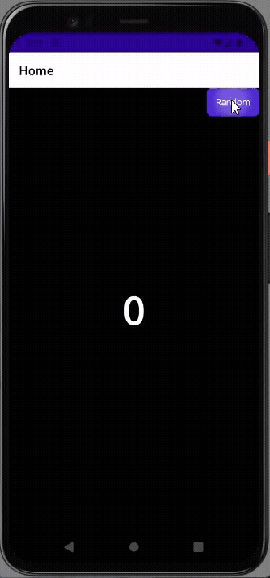

# OdometerCounterViewMaui

An animated odometer-style counter control for .NET MAUI applications. This control provides smooth scrolling transitions for numbers, perfect for displaying changing values like mileage, scores, currency, or counts.

## Demo

| Android | iPhone |
| :---: | :---: |
|  |  |

## Features

- **Smooth Animations**: Digits roll smoothly to their new values with a customizable visual style.
- **Customizable Appearance**: Full support for standard font customization including:
    - `FontSize`
    - `FontFamily`
    - `TextColor`
    - `DurationMs`
- **Thousand Separators**: Optional display of commas as thousand separators (enable with `IsThousandSeparatorEnabled="True"`).
- **Compact Notation**: Formats large numbers with suffixes like K, M, B, T (e.g. 1.5M). Enable with `UseCompactNotation="True"`. Note: This property is mutually exclusive with `IsThousandSeparatorEnabled`.
- **Haptic Feedback**: Optional vibration feedback when numbers change (enable with `IsHapticFeedbackEnabled="True"`). (Available in 1.0.5-beta)
- **Flexible Data Binding**: Simply bind the `TargetValue` property to any `long` or `int` integer to trigger the animation. Supports very large numbers (64-bit).
- **Dynamic Sizing**: The control automatically sizes itself based on the number of digits and font settings.
- **Performance Optimized**: efficiently handles updates to minimize UI thread impact.

## Usage

Simply add the namespace and use the `OdometerView` control in your XAML.

### Basic Usage

```xml
<xmlns:controls="clr-namespace:OdometerCounterViewMaui;assembly=OdometerCounterViewMaui">

<controls:OdometerView 
    TargetValue="12345"
    FontSize="50"
    DurationMs="500"
    IsHapticFeedbackEnabled="True"
    TextColor="{StaticResource Primary}" />
```

### Binding Example

```xml
<controls:OdometerView 
    TargetValue="{Binding CurrentCount}"
    FontSize="32"
    IsThousandSeparatorEnabled="True"
    DurationMs="1500"
    TextColor="Black" />
```

## Installation

[](https://www.nuget.org/packages/OdometerCounterViewMaui/)

You can install the package via the NuGet Package Manager or the CLI:

```bash
dotnet add package OdometerCounterViewMaui
```